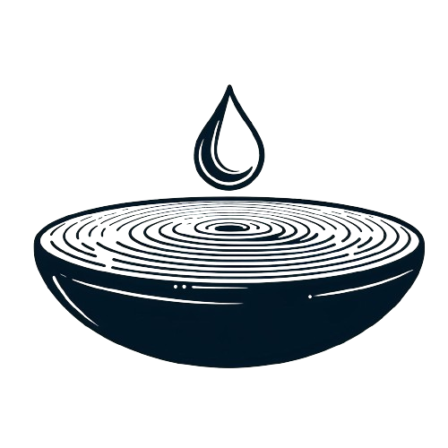

# Droplet Search

Droplet Search is a technique to optimize machine learning kernels, based on the coordinate descent algorithm. To know more about it, you can take a look into [this paper](https://homepages.dcc.ufmg.br/~michaelcanesche/paper/droplet_paper.pdf).

<p align="center">
  <br>
  <a href="https://github.com/lac-dcc/garkain/blob/main/LICENSE"></a>
  <a href="https://github.com/PyCQA/pylint"></a>
  <a href="https://github.com/lac-dcc/garkain/commits/main">
    
  </a>
</p>

## **Contents Table**

* [Introduction](#introduction)
* [Getting Started](#getting-started)
    * [Prerequisites](#prerequisites)
    * [Setup](#setup)
    * [Running](#running)
* [Structure](#structure)
* [Technical Report](#technical-report)

---
<a id="introduction"></a>

## **Introduction**

Droplet is already [merge](https://github.com/apache/tvm/pull/14683) on Apache TVM since the version 0.13.0. This repository is used as an artifact for the paper.

---
<a id="getting-started"></a>

## **Getting Started**

In this section are the steps to reproduce our experiments.

### **Prerequisites**

You need to install the following packages to run this project:

* [Docker](https://www.docker.com/get-started/) and [Docker Compose](https://docs.docker.com/compose/install/) to run our experiments
* [Python-3](https://www.python.org/downloads/) to plot the results in the project's Jupyter Notebook

For ***nvidia docker***, please follow this instructions: [Nvidia Container](https://docs.nvidia.com/datacenter/cloud-native/container-toolkit/latest/install-guide.html)

<a id="setup"></a>

###  **Setup**

We developed a dockerfile with the experiments and all requirements installed. We recommend using this solution if you want to compare it with our solution. Below, for each architecture supported, is present how to build the docker.

```
bash scripts/build_docker.sh <ARCH>
```

Where ```<ARCH>``` can be x86, arm, or cuda.

<a id="running"></a>

### **Running**
You can run the docker following command line:

```bash
bash scripts/run_docker.sh <ARCH>
```

Where ```<ARCH>``` can be x86, arm, or cuda.

To execute the neural networks models (Figure 11):

```bash
bash scripts/cnn_models.sh <ARCH>
```

To measure the impact of the p-value in droplet (Figure 12):
```bash
bash scripts/droplet_pvalue.sh <ARCH>
```

To execute microkernels (Appendix), you must use the following script:

```bash
bash scripts/microkernels.sh
```


---
<a id="structure"></a>

## Structure
The repository has the following organization:

```bash
|-- results: "Place which your data will be save for default"
|-- docker: "Scripts for build the docker"
|-- docs: "Repository documentation"
|-- scripts: "Scripts for build the docker and generate some images"
|-- src: "Source code"
    |-- handmade: "Extra experiments using the droplet to verify how the space search works"
    |-- microkernels: "Python scripts to run microkernel presents in the paper"
    |-- tvm: "Python scripts to run NN models presents in the paper"
|-- thirdparty: "Third-party code for comparison with our experiments."
```


---
<a id="technical-report"></a>

## Technical Report

This framework is used in the following published papers:

```bash
TODO: in submission of the paper.
```