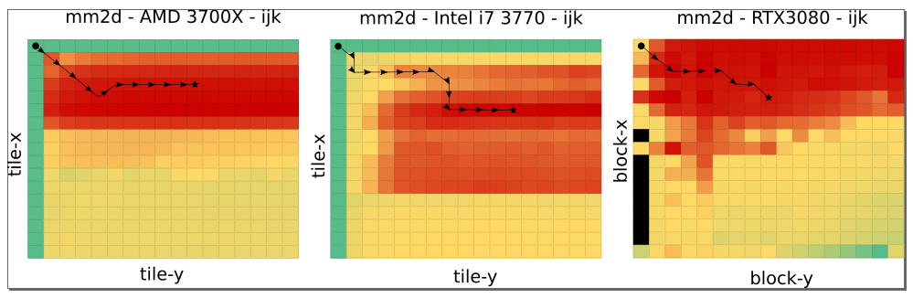

    <h1> Garkain </h1>
    

        Garkain is a space search algorithm in the compiler optimization space
    

  

  
  
  

## **Contents Table**

* [Introduction](#introduction)
* [Getting Started](#getting-started)
    * [Prerequisites](#prerequisites)
    * [Setup](#setup)
    * [Running](#running)

---

## **Introduction**

TODO: introduction text here

---

## **Getting Started**

In this section are the steps to reproduce our experiments.

### **Prerequisites**

You need to install the following packages to run this project:

* [Docker](https://www.docker.com/get-started/) and [Docker Compose](https://docs.docker.com/compose/install/) to run our experiments
* [Python-3](https://www.python.org/downloads/) to plot the results in the project's Jupyter Notebook

###  **Setup**

TODO: setup under construction.

### **Running**
Now, you can run the following command line:

TODO: script under contruction.

---

## Technical Report

This framework is used in the following published papers:

TODO: in submission the paper.

